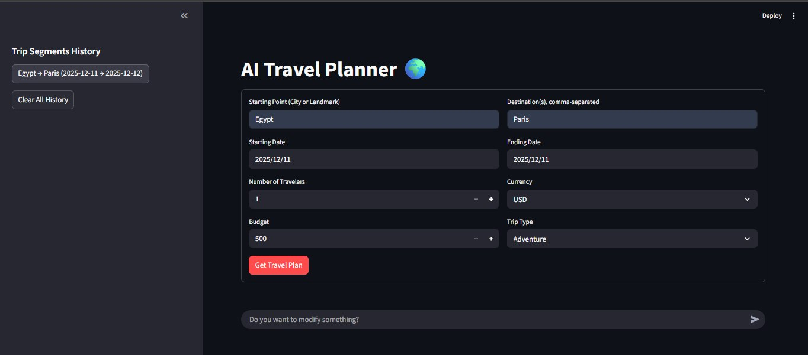

# 🌍 AI Travel Planner - Personalized Trip Itinerary Generator


[](https://aitripplannerusingllm-wdkhgcdfs6pieqyha8gzcm.streamlit.app/)

This is an interactive web application built using **Streamlit** and the **Groq API** to generate detailed, daily travel itineraries based on user inputs such as destination, dates, budget, and travel style. The application leverages large language models (LLMs) to create comprehensive, customized trip plans instantly.

---

## ✨ Key Features

* **Customized Planning:** Generates daily itineraries covering transportation, accommodation suggestions, key attractions, estimated costs, and local cuisine recommendations.
* **Secure Secrets Management:** Utilizes Streamlit Secrets for the secure storage and handling of the Groq API key.
* **Trip History:** Stores and allows viewing of previously generated trip segments in a convenient sidebar.
* **Interactive Follow-up:** A chat interface is available to modify the generated plan, ask follow-up questions, or request refinements.

---

## 🛠️ Technology Stack

| Component | Technology | Description |
| :--- | :--- | :--- |
| **Framework** | Streamlit | Used for fast development of the web interface. |
| **Backend/AI** | Groq | Provides high-speed LLM inference for itinerary generation. |
| **Language** | Python | Core programming language. |
| **Dependencies** | `requirements.txt` | Dependency management. |

## ⚙️ Setup and Installation

### 1. Prerequisites

Ensure you have Python installed. Clone the repository:

```bash
git clone https://github.com/YOUR_USERNAME/YOUR_REPOSITORY_NAME.git
cd YOUR_REPOSITORY_NAME
```

### 2. Dependency Installation

Install required Python packages:

```bash
pip install -r requirements.txt
```

**Content of `requirements.txt`:**

```
streamlit
groq
```

### 3. API Key Configuration

The application requires a **Groq API Key**.

#### A. Local Setup (For Development)

1. Create a folder named **`.streamlit`** in the root directory.
2. Inside it, create a file named **`secrets.toml`**.
3. Add your key:

   ```toml
   GROQ_API_KEY = "your-actual-groq-api-key-starting-with-gsk_"
   ```

4. Add `secrets.toml` to `.gitignore`.

#### B. Streamlit Cloud Deployment (For Production)

Provide the same key in the **Advanced Settings → Secrets** section:

```toml
GROQ_API_KEY = "your-actual-groq-api-key-starting-with-gsk_"
```

---

## 🏃 How to Run Locally

```bash
streamlit run AI_Trip_Planner.py
```

---

## 💡 Future Work and Enhancements

1. **AI Agent Integration (Agent-based Planning):**
   * **Goal:** Move beyond static itinerary generation to dynamic, tool-augmented planning.
   * **Implementation:** Use a multi-tool LLM agent (e.g., LangChain or CrewAI) equipped with:
       * Web search tools for fetching current events, local restrictions, and attraction hours.
       * Flight/hotel availability tools for generating real booking links.
   * **Benefit:** Iterative “thinking” and real-time refinement of the itinerary.

2. **Interactive Mapping:**
   * Integrate Folium or Pydeck for visualizing routes, landmarks, and daily travel paths.

3. **Real-time Cost Estimation:**
   * Connect to live APIs for currency conversion and updated cost predictions.

4. **Export Functionality:**
   * Provide options to export the final plan as PDF or `.ics` calendar files.

---

## 🚀 Live Demo

You can access the deployed application here:  
[**Open AI Travel Planner on Streamlit Cloud**](https://aitripplannerusingllm-wdkhgcdfs6pieqyha8gzcm.streamlit.app/)


## 🖼️ Screenshot

Below is a screenshot of the application interface:



